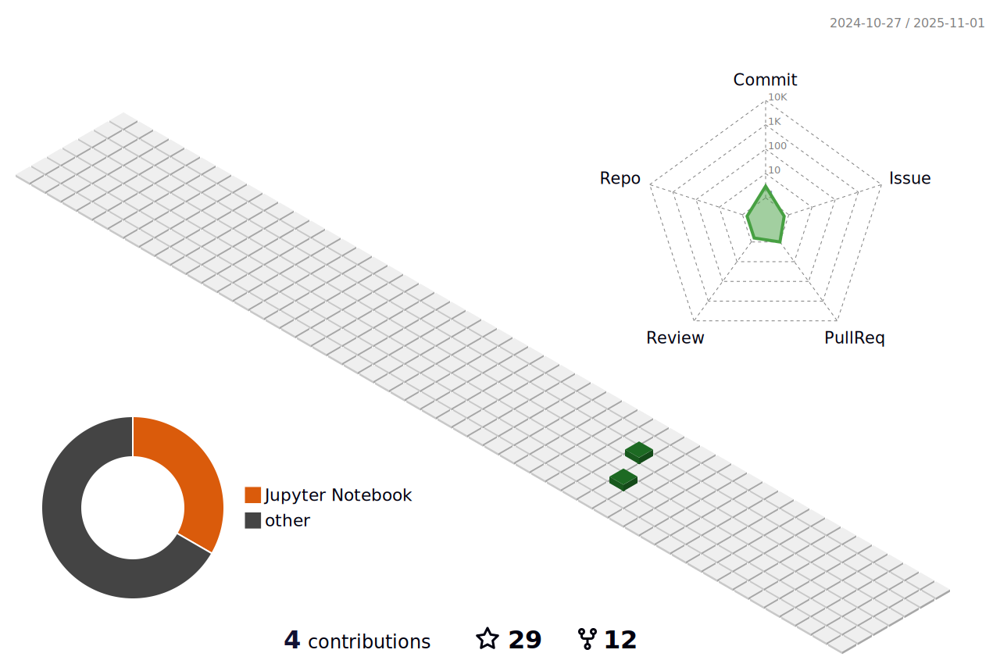

#  🥷🏻Chandan Dwivedi

**`AI Engineer`**

- 👋 Hi, I’m Chandan Dwivedi
- 👀 I’m interested in Artifical Intelligence and Machine Learning
- 🌱 I’m currently learning Reinforcement Learning
- 💞️ I’m looking to collaborate on ML,Deep Learning, Neural Networks

Need to contact me? Find me here:

<a href="mailto:chandand2507@gmail.com">
  
  
  

 

<!---
Jargon4072/Jargon4072 is a ✨ special ✨ repository because its `README.md` (this file) appears on your GitHub profile.
You can click the Preview link to take a look at your changes.
--->
---
### 🧑🏼‍💻 Languages and Tools I work with:

 
 
 

#

### 📠 My Latest Blogs:

<a target="_blank" href="https://github-readme-medium-recent-article.vercel.app/medium/@c_dwivedi/0"> 
<a target="_blank" href="https://github-readme-medium-recent-article.vercel.app/medium/@c_dwivedi/1"> 

#

### 📊 Stats

<!--  -->

 

#

